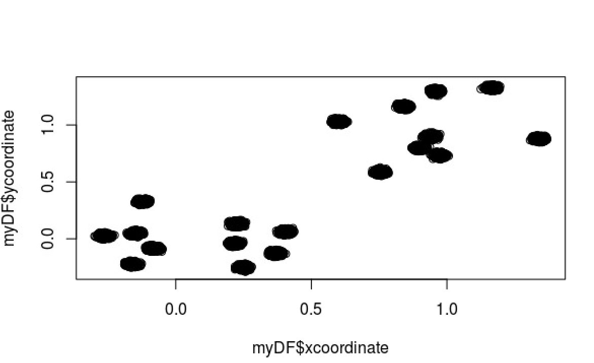
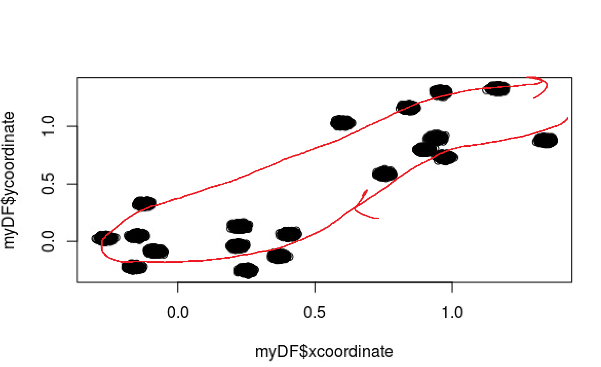

# xtern-dataset-findings

The number of scooters with different power levels are:

| 0    | 1    | 2    | 3    | 4    | 5    |
|------|------|------|------|------|------|
| 4388 | 4248 | 4245 | 4160 | 4284 | 4343 |

We can see that out of all the scooters we picked up, we have roughly the same number of scooters in each power level. 

The operation time cost is will then be (5 * 4388) + (4 * 4248) + (3 * 4245) + (2 * 4160) + (1 * 4284) + (0 * 4343) = **64271 hours**.

The coordinates with the most number scooters picked up are shown in the following graph:

The locations around -0.5 < x < 0.5 and -0.5 < y < 0.5 and 0.5 < x < 1.5 and 0.5 < y < 1.5 seem to be a really popular spots for scooters of all power levels, because relatively equal number of scooters in each power levels are found in the same (or really close) areas!

Disregarding all the unknown restrictions, let's assume the pick-up bus have free control over where they are heading in the region of the coordinates given -- no winding roads, block buildings, or rivers to impede the bus' routes.

In that case, the obvious charging strategy is to move diagonally across from the starting point to the lower right corner of the given coordinates, like this:

The bus can start from the charging station at (20.19, 20.19) and move southwest (assuming north is the top of the screen) until about (-0.5, -0.5). As the bus approaches (1.5, 1.5), there should be plenty of scooters to pickup. At the distribution of power levels we currently have, we can randomly pickup any scooters and be sure that ~17% of the scooters will be at power level 0, and 50% of the scooters picked up will be at power level 2 or below. Let's say we pick up about half of all the scooters we have, by the time we get back to the charging station, charge them and bring 'em back, we should be able to replace the entire next half with fully charged scooters at the time when the scooters that weren't previously picked up are at low power levels. And if usage of our scooters isn't too popular that day, we can have most if not all of the scooters fully charged with only two trips made!
